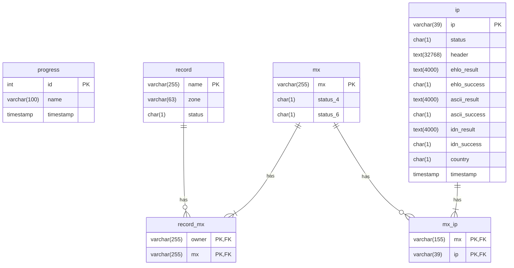

# EAI Survey Tool
## Introduction
The EAI Support Survey Tool is a program that tests all the Mail Exchange servers for support of UTF8 and internationalized domain names.

The application is built in Java 8 and uses a MariaDB database to store the tests' results temporarily.

## Requirements
### Compiling the source code
- Java Compiler version 8 or superior.
- Apache Maven version 3.6 or superior.
### Compiling the source code with Buildah and creating an Podman/Docker image
- Buildah 1.19.6 or superior.
### Manual Execution
- Java JRE version 8 or superior.
- Docker CE version 20.10.7 or superior.
- MariaDB client version 15.1 or superior.
- SnowSQL version 1.2.16 or superior.
- User must be on the docker group.
- User must be able to run sudo.
### Podman Execution
- Podman 3.0.1 or superior.
- SnowSQL version 1.2.16 or superior.
- User must be able to run sudo.
### Docker Execution
- Docker CE version 20.10.7 or superior.
- SnowSQL version 1.2.16 or superior.
- User must be on the docker group.
- User must be able to run sudo.

## Manual Execution
### Compiling the Source Code
To compile the source code, the user can use Apache Maven. Apache Maven Assembly Plugin is used to create the distribution package. To create the distribution package is created executing these couple of commands on the command line at the project's root directory.
```
$ git clone https://github.com/icann/eai-survey-tool.git
$ cd eai-survey-tool
$ mvn package
$ mvn assembly:single
```
After running these steps, the distribution bundle will be created on the target folder, and will have the name eai-survey-$VERSION.tar.gz. This bundle will contain all the compiled code and dependencies. The only thing missing will be the configuration files: config.properties and logging.properties.

### Installation
The user can install the application decompressing the tar file at any location. The tar file contains all the needed files and dependencies.

```
tar -xvf eai-survey-$VERSION.tar.gz
```

## Podman/Docker Execution
### Compiling the Source Code
To compile the source code, the user can use the buildah.sh script that utilizes buildah to compile the source code and creates a Podman/Docker image.
```
$ git clone https://github.com/icann/eai-survey-tool.git
$ cd eai-survey-tool
$ buildah unshare
$ scripts/buildah.sh
$ exit
```

## Configuration
The user can configure the application using a configuration file named config.properties. The application search this file at the install directory of the application by default.

The following parameters are configurable in the configuration file.
Parameters with values in unicode MUST use unicode escape as per the Java Language Specification. For example, for the internationalized email addres, provide an address in escaped form:
```
\u0645\u062b\u0627\u0644@\u0627\u062e\u062a\u0628\u0627\u0631-\u0627\u0644\u0642\u0628\u0648\u0644-\u0627\u0644\u0639\u0627\u0644\u0645\u064a.\u0634\u0628\u0643\u0629
```
Instead of the original form:
```
smtp.tester.email.idn = مثال@اختبار-القبول-العالمي.شبكة
```


| Parameter | Default Value | Description |
| --- | --- | --- |
| local.addresses.ipv4 | [local ip address] | IPv4 local addresses.|
| local.addresses.ipv6 | [local ip address] | IPv6 local addresses.|
| db.username |   | Database username.|
| db.password |   | Database password.|
| db.url |   | Database URL.|
| db.driverClassName | org.mariadb.jdbc.Driver | Database Driver.|
| db.defaultAutoCommit | false | Database connection auto commit.|
| db.maxTotal | 125 | Database max number of connections.|
| db.batch.size | 1000 | Database connection batch size.|
| db.statement.fetch_size | 5000 | Database cursor fetch size.|
| maxmind.database.filename | geoip/GeoIP2-Country.mmdb | MaxMind Database filename.|
| resolver.address | 8.8.8.8, 2001:4860:4860::8888 | DNS Resolver Addresses.|
| resolver.threads | 1250 | DNS Resolver threads per local IP Address
| resolver.duration | PT1S | DNS Resolver query rate.|
| resolver.timeout | PT15S | DNS Resolver connection timeout.|
| resolver.wait | PT5M | DNS Resolver writer queue timeout.|
| resolver.retries | 3 | DNS Resolver retries.|
| smtp.tester.threads | 4096 | SMTP Tester threads count.|
| smtp.tester.threads.wait | PT30M | SMTP Tester waiting time for the queues.|
| smtp.tester.timeout.connect | PT5M | SMTP Tester connection timeout.|
| smtp.tester.timeout.idle | PT5M | SMTP Tester idle timeout.|
| smtp.tester.retries | 1 | SMTP Tester retries.|
| smtp.tester.wait | PT30S | SMTP Tester waiting time between retries.|
| smtp.tester.domain | example.com | SMTP Tester domain name.|
| smtp.tester.email.ascii |  | SMTP Tester ASCII email. Characters must be unicode escaped |
| smtp.tester.email.idn |  | SMTP Tester IDN email. Characters must be unicode escaped |
| smtp.tester.quarantine.period | PT1S | SMTP Tester Quarantine period.|
| smtp.tester.quarantine.timeout | PT15S | SMTP Tester Quarantine timeout.|
| smtp.tester.quarantine.expire | PT15M | SMTP Tester Quarantine expire.|
| smtp.tester.quarantine.cidr.ipv4 | 16 | SMTP Tester Quarantine IPv4 CIDR.|
| smtp.tester.quarantine.cidr.ipv6 | 48 | SMTP Tester Quarantine IPv6 CIDR.|
| sentinel.threshold | 0.05 | Sentinel error threshold percentage. After this value the program is stopped.|
| sentinel.period | PT1S | Sentinel period |
| sentinel.min | 10 | Sentinel minimal request for evaluation. |
| ip.exclude | | List of IP addresses to exclude from the survey. |

### Example Configuration
```
local.addresses.ipv4 = 127.0.0.1
local.addresses.ipv6 = 2600:1f14:df0:400:67ec:ada:c748:6fa2

resolver.address = 8.8.8.8, 2001:4860:4860::8888
resolver.threads = 1250

smtp.tester.threads = 32000
smtp.tester.quarantine.cidr.ipv4 = 20
smtp.tester.quarantine.cidr.ipv6 = 48

db.username = [redacted]
db.password = [redacted]
db.url = jdbc:mariadb://127.0.0.1:3306/eai?useServerPrepStmts=false&rewriteBatchedStatements=true

smtp.tester.domain = testo.tel
smtp.tester.email.ascii = \u0645\u062b\u0627\u0644@xn-----btdabbacdp7b0bzhrf3accct6cwc.xn--ngbc5azd
smtp.tester.email.idn = \u0645\u062b\u0627\u0644@\u0627\u062e\u062a\u0628\u0627\u0631-\u0627\u0644\u0642\u0628\u0648\u0644-\u0627\u0644\u0639\u0627\u0644\u0645\u064a.\u0634\u0628\u0643\u0629

ip.exclude = 1.1.1.1/32, 1.1.1.2/32
```
## Logging Configuration
The logging is configured using a file named logging.properties located in the root directory of the application.

The application uses the standard Java Logger; here is the link to the complete documentation.https://docs.oracle.com/javase/8/docs/technotes/guides/logging/overview.html

### Example Logging Configuration
```
handlers = java.util.logging.FileHandler, java.util.logging.ConsoleHandler
.level = SEVERE

org.icann.eai.survey.EaiSurvey.level = INFO
org.icann.eai.survey.Sentinel.level = INFO

java.util.logging.FileHandler.formatter = java.util.logging.SimpleFormatter
java.util.logging.FileHandler.pattern = logs/log%g.log
java.util.logging.FileHandler.limit = 10485760
java.util.logging.FileHandler.count = 3
```
## Running the survey
### 1. Configure the scripts.
The first step is to configure the scripts. All the scripts use the same configuration file in the script folder with the name scripts.cfg.
| Constant | Example | Description |
| -------- | ------- | ------------|
| WORK_DIR | $HOME/temp | Base working directory |
| EAI_NAME | eai-survey | EAI Tool name |
| EAI_VERSION | 1.1.0 | EAI Tool version |
| EAI_IMAGE | $EAI_NAME:$EAI_VERSION | EAI Tool container image |
| EAI_CONFIG_FILENAME | $PWD/config.properties | EAI Tool configuration file |
| EAI_LOG_CONFIG_FILENAME | $PWD/logging.properties | EAI Tool log configuration file |
| EAI_MAXMIND_FILENAME | $HOME/geoip/GeoIP2-Country.mmdb | EAI Tool MaxMind database file |
| EAI_RUN_COMMAND | java -Xmx4g -jar $EAI_NAME-$EAI_VERSION.jar | EAI Tool execution command |
| BUILDAH_BUILDER_IMAGE | registry.access.redhat.com/ubi8/openjdk-11 | Buildah builder container image |
| BUILDAH_RUN_IMAGE | registry.access.redhat.com/ubi8/openjdk-11-runtime | Buildah run container image |
| ZONES_SRC_DIR | $HOME/zones | Sorce zones directory |
| ZONES_DIR | $WORK_DIR/zones | Working zones directory |
| DB_DIR | $WORK_DIR/data | Database files |
| DB_IMAGE | docker.io/mariadb | Database container image |
| DB_BIND_ADDR | 127.0.0.1 | Database binding address |
| DB_BIND_PORT | 3306 | Database binding port |
| DB_INIT_SCRIPT_FILENAME | $PWD/src/test/resources/tables.sql | Database initial script |
| DB_NAME | maria | Database container name |
| DB_MEM | 20G | Memory used by the database |
| DB_USERNAME | eai | Database username |
| DB_PASSWORD | eai | Database password |
| CSV_DIR | $WORK_DIR/csv | Output directory |
| AWS_DIR | $HOME/.aws | Amazon AWS client config path |
| AWS_IMAGE | docker.io/amazon/aws-cli | Amazon AWS client container image |
| SNOWSQL_DIR | $HOME/.snowsql | SnowSQL client path |
| SQL_FILENAME | dev/shm/import.sql | Temporal sql file with the results |
| TABLES | ("progress" "record" "record_mx" "mx" "mx_ip" "ip") | List of tables to export |
| S3_URL | s3://example | AWS S3 URL to upload |

### 2. Execute setup.sh script.
The next step is  executing the `setup.sh` script. This script search for the latest zones files, decompress them, parse them, and creates an import database file. This script also creates a Docker container from the latest version of MariaDB image.

Zone files are expected to be found in the location specified by the `ZONES_SRC_DIR` parameter, following the structure below. In the directory structure, the `yyyymmdd` directory is replaced with the date corresponding to the date of the zone files to be used in the survey, and `tld1`, `tld2`, etc. is replaced with the actual TLDs to be surveyed. If more than one directory is found for multiple dates, the script will consider the directory named after the latest date available only:
 - source_directory (as configured for the ZONES_SRC_DIR constant)
   - yyyymmdd
     - tld1
       - tld1.zone.gz
     - tld2
       - tld2.zone.gz

### 3.a Manual Execution: Running the main JAR
The next step is to execute the main JAR file. This application will search, resolve, and test all the Mail Exchange servers. If a critical error occurs at any point of the execution, the user can re-run this application and resume the test.
```
java -Xmx4g -jar eai-survey-1.1.0.jar
```
Users can check the progress of the survey querying the temporary database.
```
# Check general progress. The timestamp indicates when the step was finished.
select * from progress;

# Count SLD to process
select count(*) from record where status = 'N';

# Count MX to resolve
select count(*) from mx where status_4 = 'N' or status_6 = 'N';

# Count MX to test
select count(*) from ip where status = 'N';
```
### 3.b Podman/Docker Execution: Runing the survey
The next step is running the survey using the run.sh script that utilizes Podman or Docker to run the code inside a container.
```
scripts/run.sh
```
Users can check the progress of the survey querying the temporary database.
```
# Check general progress. The timestamp indicates when the step was finished.
select * from progress;

# Count SLD to process
select count(*) from record where status = 'N';

# Count MX to resolve
select count(*) from mx where status_4 = 'N' or status_6 = 'N';

# Count MX to test
select count(*) from ip where status = 'N';
```
### 4. Checking the results (Optional)
The user also can use the `report.sh` script to display a summary of the execution. This script can take a while, so please be patient. The user and password to use for accessing the database must be replaced accordingly.

Here is an example of the execution.
```
$ ./report.sh

+-------------------------+---------------------+
| name                    | timestamp           |
+-------------------------+---------------------+
| Process started         | 2021-06-13 18:47:45 |
| Search MX Servers       | 2021-06-14 18:11:34 |
| Resolve IPv4 MX Servers | 2021-06-14 22:38:52 |
| Resolve IPv6 MX Servers | 2021-06-15 01:26:30 |
| Probe MX Servers        | 2021-06-17 22:53:11 |
| Resolve GeoIP Location  | 2021-07-01 01:48:25 |
+-------------------------+---------------------+

Number of SLD: 207,461,843
+----------+-------------+
| result   | count       |
+----------+-------------+
| 0K       | 100,325,168 |
| No MX    | 93,111,393  |
| NxDomain | 2,037,559   |
| Refused  | 24,007      |
| ServFail | 11,963,716  |
+----------+-------------+

Number of MX: 34,486,103

Number of IP: 2,567,691
- Server responded: 1,730,389
- Server timeout: 837,302

- Test allowed: 1,715,913
- Test denied: 768

- EHLO test passed: 168,941
- ASCII test passed: 155,439
- UTF-8 test passed: 155,071
```
### 5. Exporting the results (Optional)
Once that the survey completes, the user can use the export.sh script to export all database tables into CSV files. The script also compresses the files to optimize upload time to the S3 bucket. And finally, the script imports all the data into the snowflake data warehouse.

The S3 bucket and the SnowSQL client must be configured and available to the user. Here is a copy of the used configurations:

#### ~/.aws/config
```
[default]
region = [redacted]
```
#### ~/.aws/credentials
```
[default]
aws_access_key_id = [redacted]
aws_secret_access_key = [redacted]
```
#### ~/.snowsql/config
```
[connections]
accountname = [redacted]
username = [redacted]
password = [redacted]
dbname = [redacted]
schema = [redacted]
warehousename = [redacted]
rolename = [redacted]
```
## Results ER Diagram


| progress | Records the time when a step of the survey was finished |
| --- | --- |
| id | Step id |
| name | Step name |
| timestamp | Timestamp when the step was finished |

| record | Records of all the zones |
| --- | --- |
| owner | SLD |
| zone | Zone |
| status | Search for MX Servers Status [1] |

| mx | List the MX servers related to the records |
| --- | --- |
| mx | MX Server |
| status_4 | Resolve IPv4 Status [1] |
| status_6 | Resolve IPv6 Status [1] |

| ip | List the IP addresses for the MX servers |
| --- | --- |
| ip | IP Address |
| status | Survey test status for the IP address [2] |
| header | Server message when first connected |
| ehlo_result | Server response to the EHLO command |
| ehlo_success | Indicate if EHLO test was successful |
| ascii_result | Server response to the ASCII test |
| ascii_success | Indicate if the ASCII test was successful |
| idn_result | Server response to the IDN test |
| idn_success | Indicate if the IDN test was successful |
| country | Country code of the IP address. |
| timestamp | Timestamp of the test |

[1] Status List:
 - N - No Searched
 - S - Searched (No Error)
 - X - Empty Answer
 - \# - RCode
 - E - Unexpected Error

 [2] IP Status List:
 - N - No Tested
 - S - Skipped Special
 - X - Excluded
 - T - Tested

# License

 Copyright 2021 Internet Corporation for Assigned Names and Numbers ("ICANN")

 Licensed under the Apache License, Version 2.0 (the "License");
 you may not use this file except in compliance with the License.
 You may obtain a copy of the License at

 http://www.apache.org/licenses/LICENSE-2.0

 Unless required by applicable law or agreed to in writing, software
 distributed under the License is distributed on an "AS IS" BASIS,
 WITHOUT WARRANTIES OR CONDITIONS OF ANY KIND, either express or implied.
 See the License for the specific language governing permissions and
 limitations under the License.

